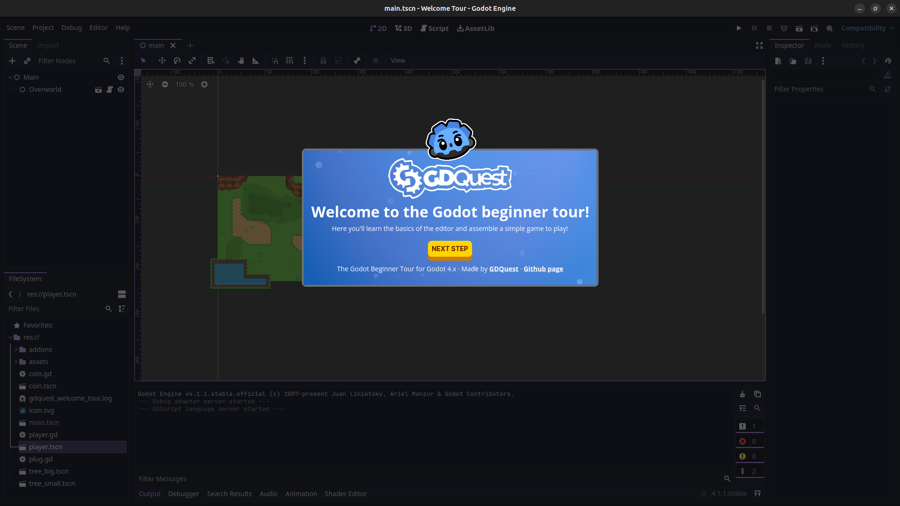

# Godot Welcome Tour aka GDTour

This Godot project contains an addon called **GDQuest Welcome Tour** which provides a guided explanation of the *Editor Interface* by assembling a mini-game step-by-step.



## GDQuest Welcome Tour Overview

The addon is found at `addons/gdquest_welcome_tour` and is split into three directories:

- `core`: makes up the functionality of the addon.
- `scripts`: handles exporting the Godot project to an independent `*.zip` file via the `export.gd` `EditorScript`.
- `tours`: subfolders containing a `*.gd` file that constructs the guided tour(s) with the help of the addon API.

GDQuest Welcome Tour provides these `core` systems:

- The UI Bubble which provides step-by-step instructions and explanations. It contains:

  - An optional header.
  - Any number of text descriptions, media (images, videos), code listings, and (verifiable) tasks added to the body.
  - An optional footer.
  - The GDBot avatar.

- A Debugger panel which helps instructors prepare the tours toggled with <kbd>CTRL</kbd><kbd>F10</kbd>.
- A Mouse Preview for previewing actions such as: Drag n' Drop, Click, Press, Release.
- An Overlays manager that prevents students from interacting with the *Editor Interface* UI elements. The instructor can give access to the underlying UI elements using highlights that disable the overlays on mouse-over.
- A Translation system provides two functions:

  - A Parser that extracts strings used in `gtr()`, `gtr_n()` and `ptr()` function calls.
  - A `*.[mo,po]` files loader and mapper depending on the *Editor* language setting.

- A Tour builder API that constructs the actual guided steps using the systems listed so far.

## Using GDQuest Welcome Tour in Other Projects

The easiest way to "install" this addon is to use [gd-plug](https://github.com/imjp94/gd-plug):

1. Install **gd-plug** using the Godot Asset Library.
2. Save the following code listing into the `res://plug.gd` file:

  ```gdscript
  #!/usr/bin/env -S godot --headless --script
  extends "res://addons/gd-plug/plug.gd"


  func _plugging() -> void:
  	plug(
  		"git@github.com:GDQuest/godot-welcome-tour.git",
  		{include = ["addons/godot_welcome_tour"]}
  	)
  ```

3. Make the `res://plug.gd` script executable with `chmod +x plug.gd`.
4. Run `./plug.gd install` or `godot --headless --script plug.gd install`.

The plugin installs with the default *welcome* tour which needs to be modified for the given project.
